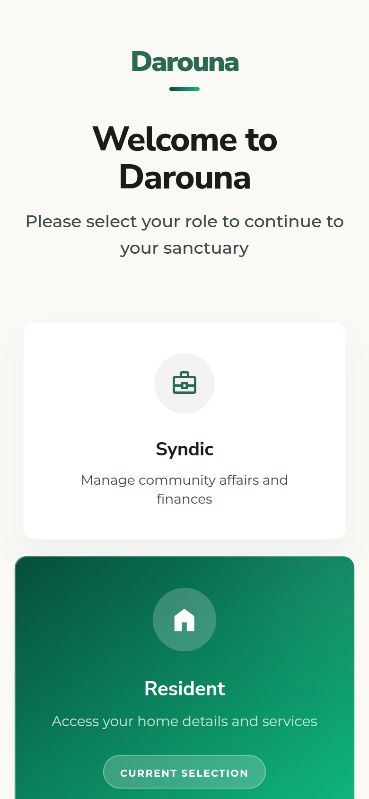
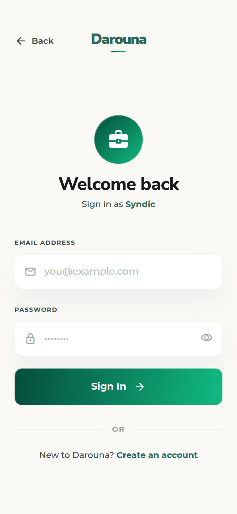
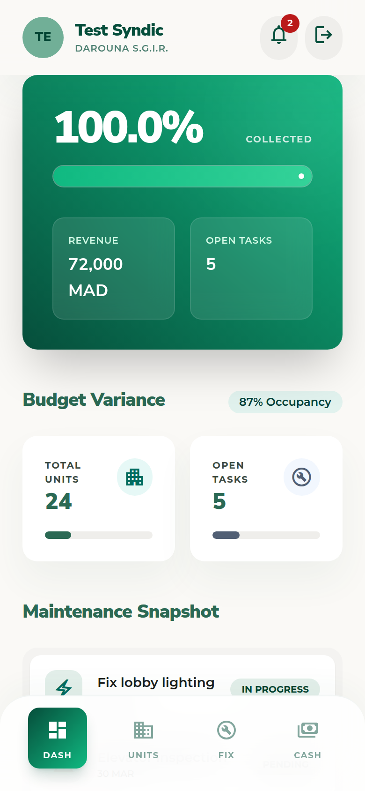
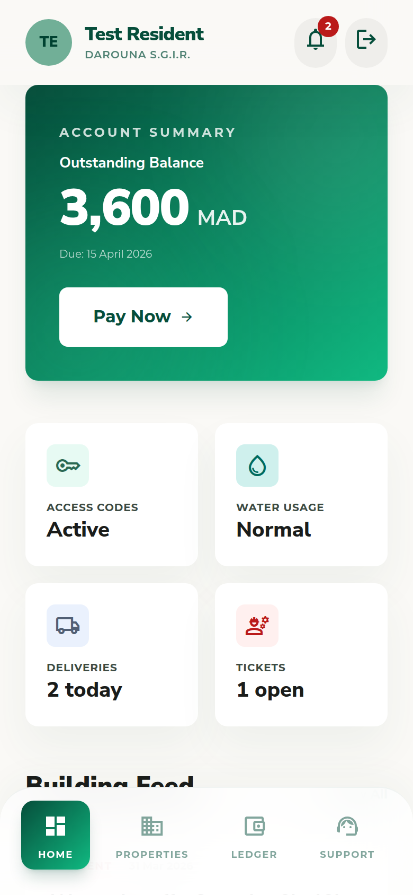
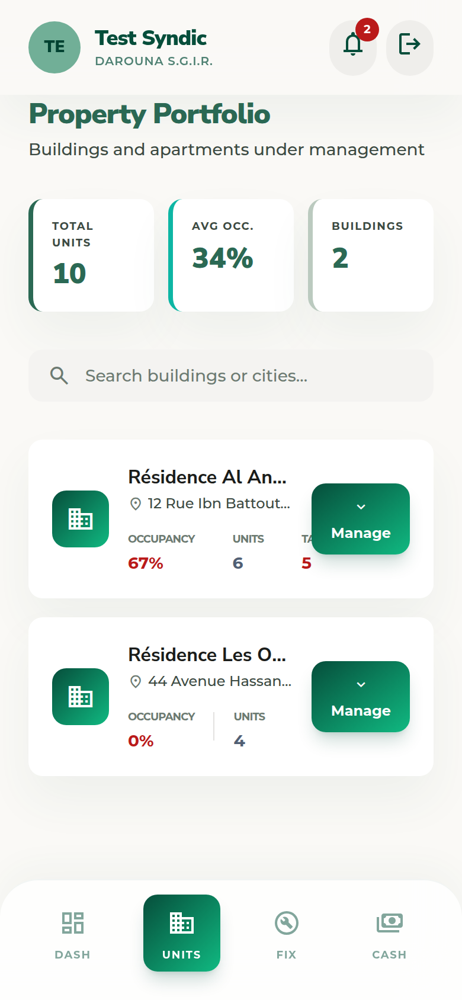
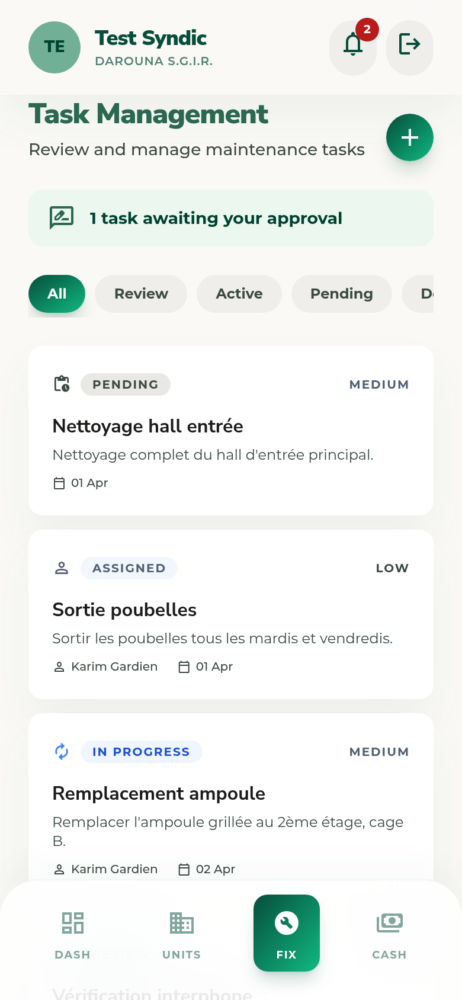
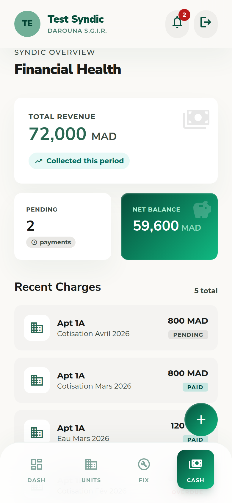
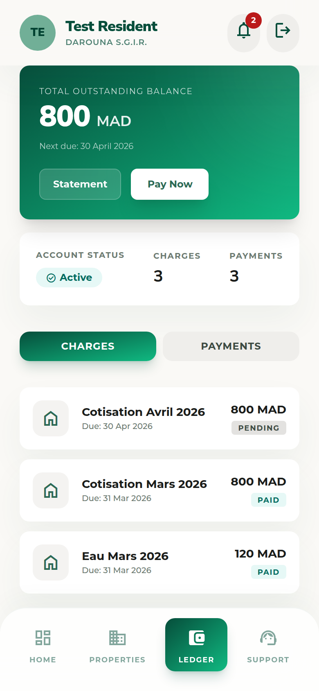
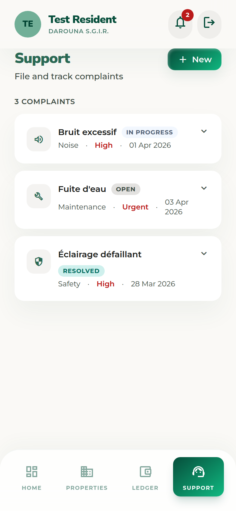

# Darouna — S.G.I.R.

**Système de Gestion Immobilière Résidentielle**

A mobile-first Progressive Web App for residential building management in North Africa (Algeria, Morocco, France). Built for three distinct roles: Syndic (manager), Resident, and Gardien (caretaker).

🌐 **Live:** [darouna.vercel.app](https://darouna.vercel.app)

---

## Screenshots

<table>
  <tr>
    <td align="center"><b>Role Select</b></td>
    <td align="center"><b>Login</b></td>
    <td align="center"><b>Syndic Dashboard</b></td>
    <td align="center"><b>Resident Dashboard</b></td>
  </tr>
  <tr>
    <td></td>
    <td></td>
    <td></td>
    <td></td>
  </tr>
  <tr>
    <td align="center"><b>Syndic Units</b></td>
    <td align="center"><b>Syndic Tasks</b></td>
    <td align="center"><b>Syndic Finance</b></td>
    <td align="center"><b>Resident Ledger</b></td>
  </tr>
  <tr>
    <td></td>
    <td></td>
    <td></td>
    <td></td>
  </tr>
  <tr>
    <td align="center"><b>Resident Support</b></td>
    <td align="center"><b>Gardien Dashboard</b></td>
    <td align="center"><b>Gardien Tasks</b></td>
    <td></td>
  </tr>
  <tr>
    <td></td>
    <td></td>
    <td></td>
    <td></td>
  </tr>
</table>

---

## Tech Stack


| Layer | Technology |
|-------|-----------|
| UI Framework | React 18 + TypeScript |
| Build Tool | Vite |
| Styling | Tailwind CSS (custom design tokens) |
| Routing | React Router v6 with role-based guards |
| State | Zustand (auth + global state) |
| HTTP | Axios with JWT interceptors + refresh logic |
| i18n | react-i18next — Arabic (RTL), French, English |
| PWA | Static manifest + icons (installable on mobile) |
| Backend | Node.js REST API (separate repo) |

---

## Features by Role

### Syndic (Building Manager)
- Dashboard with collection rate, budget variance, and open task summary
- Property directory: buildings and apartments management
- Task management: create, assign to gardien, approve/reject submissions
- Financial control: charges, payments, revenue reports
- Announcements and votes for building decisions
- Complaint oversight and response

### Resident
- Personal dashboard with balance, upcoming charges, and building feed
- Apartment details and lease information
- Payment ledger: full history of charges and payments
- Support: file complaints, track status, rate resolution
- Announcements feed with like/comment

### Gardien (Caretaker)
- Daily task list with status updates
- Submit completed work for syndic approval
- Finance overview
- Notification feed

---

## Getting Started

### Prerequisites

- Node.js 18+
- npm or pnpm
- Backend API running (see [darouna-sgir-backend](https://github.com/Tsuyii/darouna-sgir-backend))

### Installation

```bash
# Clone the repository
git clone https://github.com/Tsuyii/Darouna.git
cd Darouna

# Install dependencies
npm install

# Copy and configure environment variables
cp .env.example .env.local
# Edit .env.local with your API URL

# Start development server
npm run dev
```

### Build

```bash
npm run build      # Production build
npm run preview    # Preview the production build
```

---

## Environment Variables

| Variable | Description | Example |
|----------|-------------|---------|
| `VITE_API_URL` | Base URL for the backend API | `http://localhost:5000` |
| `VITE_MOCK_DATA` | Use mock data instead of live API | `true` |

Create a `.env.local` file at the project root:

```bash
VITE_API_URL=http://localhost:5000
VITE_MOCK_DATA=true
```

---

## Project Structure

```
src/
├── components/
│   ├── layout/          # TopAppBar, BottomNav, DashboardLayout
│   └── ui/              # GlassCard, MetricCard, StatusBadge, GradientButton
├── pages/
│   ├── auth/            # RoleSelect, Login, Register
│   ├── syndic/          # Dashboard, Units, Tasks, Finance
│   ├── resident/        # Dashboard, Properties, Ledger, Support
│   └── gardien/         # Dashboard, Tasks, Finance, Menu
├── lib/
│   ├── api.ts           # Axios instance with JWT interceptor
│   └── auth.ts          # Auth API calls
├── store/
│   └── authStore.ts     # Zustand auth store
├── router/
│   └── index.tsx        # Role-guarded routes
└── i18n/                # en.json, fr.json, ar.json
```

---

## Design System

The app uses the **Verdant Sanctuary / Emerald Zenith** design system with:
- Primary color: `#2b6954` (emerald green)
- Glass-morphism cards with `backdrop-filter: blur(12px)`
- Material Symbols Outlined icons
- Nunito Sans (headlines) + Montserrat (body)
- Full RTL support for Arabic

---

## License

Private — all rights reserved.
